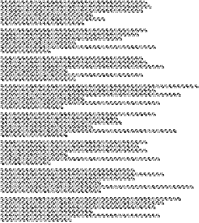

An Address
==========
We have yet to decode the meaning behind this. We are bringing this back
after giving people some time away from this challenge.

https://nostradamus.imfast.io/accb0a4ae99976a40eae8bf22e06971f.png


Writeup
-------
So I played in the CTF last year, and I had a bit of a head-start on this
problem. That said, I didn't solve it, and I had to walk back through it
this year to refresh myself. I did find a script from last year that I
used as a jumping-off point, but I'll explain the full process in this
write-up.

Looking at the picture we were given, there seems to be a pretty regular
pattern of 5x5 glyphs:



**Converting the image to text**

The first thing my teammate and I did last year when we looked at this
problem was to grab Python and convert the glyphs into something easier
to look at. It looks like the glyphs should represent text, so we wrote
a Python script (`addr2019.py`) to convert each glyph into a unique
ASCII character.

The script is a bit messy, but it chops up each "paragraph" in the image
into 6x6 glyphs, then assigns a unique ASCII character to each.

The code starts from the first printable ASCII character that isn't a
space, `!`. It runs through each glyph in the file, and each time it sees
a new glyph it adds a mapping to the next ASCII character. If it sees that
same glyph again, it just reuses the mapping it already create.d.
So the first glyph it sees becomes `!`, the second `"`, and so on through
the ASCII table.

Running `addr2019.py` prints out all of the glyphs and what we mapped
them to, followed by a mess of text representing the contents of the
image:

```
!"#$%&"'()*+,-$*.,/012%0,/0#3%&"435
6$3"1%7.#3&1"#/%,'()%1.3%8-99#/2$"4:
;<,,/%1.3=%"'()%+3%1">%+,-$%?@"432
8"#/4.A%1$#?3A%1."#$=B
C33@%"$3%+3%D,$9&%"%E$"43
;0%@"/E%'FG0%=+%"$=H

I.3%E$,"/#/E%1$3/4.3$%1.3$3%+3%&@@A
J,-$%.-$9#30%@#>3%"%9#01"/1%.#@@A
J,-$%?#/%D"9%.3@?1,%=3/9%=#@@
K/%1#=3%,'()%/339A
C.#@3%1.$,'()%+,-$%?,$30%1.3%93D0%9#@
L#>3%"=<3"9H

M#0%>/#&3%033%N-01#42@"<,-$%9#E.1A
;/'()%4-1%+3%-?%D#'()%$3"9+%0@#E.1A
I$3/4.#/E%+,-$%E-0.#/E%3/1$"#@0%<$#E.1A
L#>3%,/#3%9#14.O
;/9%1.3/A%P%D."1%"%E@,$#,-0%0#E.1A
C"$=2$33>#/A%$#4.:

I.3/A%.,$/%&,$%.,$/A%1.3+%01$314.%"/'()%01$#Q3R
S3#@%1">%1.3%.#/9=,01A%,/%1.3+%9$#Q3A
I#@@%"'()%1.3#$%D33@20D"@@'()9%>+130%<3@+Q3
;$3%<3/1%@#>3%9$-=0O
I.3/%"-@9%6-#9="/A%="#01%@#>3%1,%$#Q3A
T31."/=#1%.-=0U

K0%1.3$3%1."1%,D$3%.#0%!$3/4.%$"E,-1A
P$%,@#,%1."1%D"9%01"D%"%0,DA
P$%&$#4"0033%D"9%=">%.3$%0?3D
C#'()%?3$&341%04,//3$A
L,,>0%9,D/%D#'()%0/33$#/EA%04,$/&D'()%Q#3D
P/%0#4%"%9#//3$V

8,,$%93Q#@:%033%.#=%,D$3%.#0%1$"0.A
;0%&34=@300%"0%"%D#1.3$'()9%$"0.A
M#0%0?#/9@3%0."/=%"%E-#9%D.#?2@"0.A
M#0%/#3Q3%"%/#1O
I.$,'()%<@-#9+%&@,,9%,$%&#3@9%1,%9"0.A
P%.,D%-/&#1:

T-1%="$>%1.3%N-01#4A%."EE#02&39A
I.3%1$3=<@#/E%3"$1.%$30,-/90%.#0%1$3"9A
7@"?%#/%.#0%D"@#3%/#3Q3%"%<@"93A
M3'()@@%=">3%#1%D.#00@3O
;/'()%@3E0A%"/'()%"$=0A%"/'()%.3"90%D#@@%0/39A
L#>3%1"?0%,'()%1.$#00@3H

777WJ3%8,D'()$0%D."%=">%="/>#/9%+,-$%4"$3AX
;/9%9#0.%1.3=%,-1%1.3#$%<#@@%,'()%&"$3A
;-@9%Y4,1@"/9%D"/10%/"3%0>#/>#/E%D"$3
I."1%Z"-?0%#/%@-EE#30O
T-1A%#&%+3%D#0.%.3$%E$"13&-'()%?$"+3$A
6#3%.3$%"%M"EE#0:
```

This is all that I managed to do last year - I couldn't figure out how to get
something readable out of this.
There are a lot of characters (58, to be precise), and it didn't seem easy
to figure out a substitution cipher. This year, I got a bit further, though...

These are all random symbols at this point, with little indication of what
each one represents. However, we have some information about the flag format.
We're looking for the string `CCC{`, and now that I have this in a text format,
I went to my good friend `grep`.

I used `grep` with a regular expression to match any character `(.)`, followed
by another two of the same character matched by `(.)` (`\1\1`):

```
$ ./addr2019.py | grep -E '(.)\1\1'
777WJ3%8,D'()$0%D."%=">%="/>#/9%+,-$%4"$3AX
```

It looks like flag starts at the `777` in the last paragraph.
So I'm going to go ahead and assume that a `C` looks like this:

```
###  
     
# # #
  #  
  ###
```

And a `{` looks like this:

```
###  
#    
### #
  # #
  ###
```

The other key to the puzzle here was realizing that the data is *really* well
structured. All of the glyphs seem to have a similar shape with two squares
imposed on top of each other:

```
# #  
     
# # #
     
  # #
```

Some of those corners are connected by lines, and others aren't.
We have eight possible lines to make here...

```
$ python -c 'print("{:08b}".format(ord("C")))'
01000011
$ python -c 'print("{:08b}".format(ord("{")))'
01111011
```

There are 3 `1` bits in an ASCII `C`, and 3 lines connected in its glyph.
There are 6 `1` bits in an ASCII `{`, and 6 lines connected in its glyph.

I started writing a slightly cleaner Python script that could be used as a
better reference, but instead of converting each character to a random ASCII
value, I tried to treat the pixels for each connecting line as one of the
bits in the character. This ended up becoming `mapbits.py`.

Using just `C` and `{` for reference, I wasn't able to know for sure which
bits corresponded to which lines, so the output didn't look quite right,
but it was getting really close:

```
01000011 C
01000011 C
01000011 C
01111011 {
01011010 Z
01100110 f
00100000  
01010000 P
01101111 o
01110111 w
11100001 á
10000000 €
10011010 š
01110001 q
01110011 s
00100000  
01110111 w
01101000 h
01100010 b
00100000  
01101110 n
01100010 b
01101011 k
00100000  
01101110 n
01100010 b
01101101 m
01101011 k
01101010 j
01101101 m
01100100 d
00100000  
01111010 z
01101111 o
01110110 v
01110001 q
00100000  
01100011 c
01100010 b
01110001 q
01100110 f
00101100 ,
01111110 ~
```

That said, playing around with it for a few minutes gave me a mapping that
looked right. Each of the numbers here represents which bit the pixel controls.
The `#` markers are the corner pixels that are always there.

```
#6#  
5 7  
#4#2#
  1 3
  #0#
```

Running with that mapping gave me this:

```
01000011 C
01000011 C
01000011 C
01111011 {
01011001 Y
01100101 e
00100000  
01010000 P
01101111 o
01110111 w
11100010 â
10000000 €
10011001 ™
01110010 r
01110011 s
00100000  
01110111 w
01101000 h
01100001 a
00100000  
01101101 m
01100001 a
01101011 k
00100000  
01101101 m
01100001 a
01101110 n
01101011 k
01101001 i
01101110 n
01100100 d
00100000  
01111001 y
01101111 o
01110101 u
01110010 r
00100000  
01100011 c
01100001 a
01110010 r
01100101 e
00101100 ,
01111101 }
```

This looks like our flag! But... what's up with that `â`?
That's not ASCII! Googling the quote, I went ahead and tried putting a `'` in
there and submitting it as the flag:

`CCC{Ye Pow'rs wha mak mankind your care,}`

That didn't get accepted, though.

I noticed that the high bit (bit 7) was set on those, and realized that the flag
was actually encoded as UTF-8. I updated my code to collect all of the characters
into one string and call `.decode('utf-8')`, and I got the flag out!

`CCC{Ye Pow’rs wha mak mankind your care,}`

That's a fancy `’` in there - it's not an ASCII apostrophe.

The script `addr.py` in this repository contains the solution, which has been
updated to print out the entirety of the text for fun.
