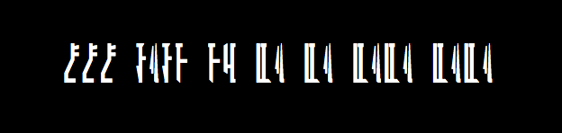
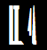
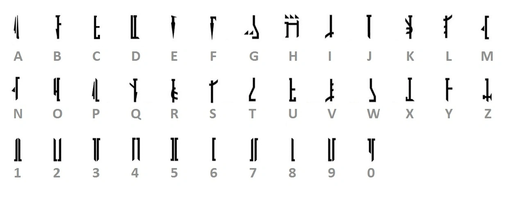

Din
===
Decode

https://nostradamus.imfast.io/din.png

Writeup
-------
This one was significantly more difficult for me than [rock-lobster].
We get an image that looks like it's in another alphabet:

I tried to reverse-image search both the full image and a single cropped
character, but got no results, unfortunately:

I wish there was anything interesting to say, but I basically just
searched Google Images for "fictional alphabets" until I found something
that looked right.

I found a Star Wars alphabet with a similar-looking "A" character that
led me to the Mandalorian alphabet:

Translating with this alphabet was fairly easy, given the repeating
characters at the end:

`CCC{BABY YO DA DA DADA DADA}`

[rock-lobster]: ../rock-lobster/README.md
