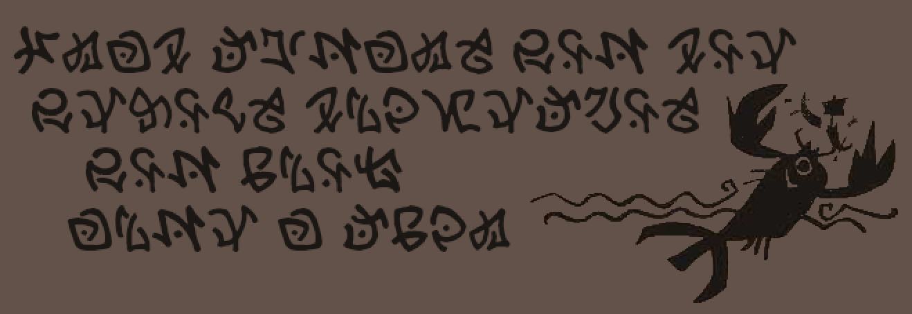
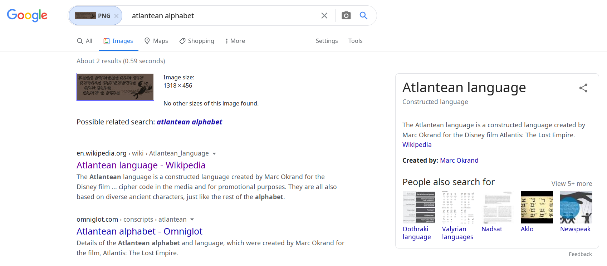

Rock Lobster
============
An old cave painting holds a secret message hidden in this ancient writing system.

https://nostradamus.imfast.io/RockLobster.png

Writeup
-------
We get an image with some strange symbols:



It looks like a foreign alphabet, but I don't recognize anything.
The lobster in the image reminded me of a Disney-style artwork, so I
Googled for things like "Moana alphabet" and "Little Mermaid alphabet".
It's a bit painful to know how close I was right at the beginning.

After that failed to produce any results, I spent some time looking at
random alphabets and getting nowhere.

After a while, I thought to try a reverse-image search.
I was expecting to need to split off specific characters from the image
or maybe the picture of the lobster, but I fed the whole image to Google
and the results were fruitful:



This led me to the Atlantean alphabet:


I transcribed the text using that alphabet:

`you got ytrops gnihtemos you know anut a ekil`

Obviously, something's a bit *fishy* with that - parts of the flag are
reversed. Reversing those gives the correct flag, a quote from Disney's
Atlantis:

`you got something sporty you know like a tuna`

Not being satisfied with things being randomly reversed without
explanation, I took another look at the image.
I noticed that the reversed bits are on the even lines, so it would be
better to transcribe it like this:

```
you got
ytrops gnihtemos
you know
anut a ekil
```

It turns out the Atlantean language is read in a serpentine fashion,
alternating from left-to-right to right-to-left between each line.
That's a pretty cool detail!
