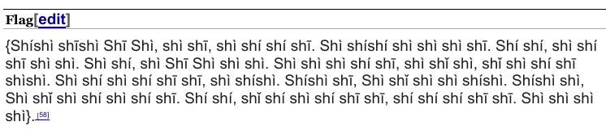

Stone Den
=========
Recover the files from this Archive please.

https://nostradamus.imfast.io/Legend_of_Zelda.zip

Writeup
-------
The file provided is a polyglot - the beginning of the file is a PDF,
and the end of it is a ZIP archive. Following the extension will mislead
you into unzipping it and poring through a lot of irrelevant data.

`binwalk` will show us the light, though:

```
$ binwalk Legend_of_Zelda.zip

DECIMAL       HEXADECIMAL     DESCRIPTION
--------------------------------------------------------------------------------
0             0x0             PDF document, version: "1.3"
72            0x48            Zip archive data, at least v2.0 to extract, compressed size: 7597, uncompressed size: 19538, name: Agahnim
7734          0x1E36          Zip archive data, at least v2.0 to extract, compressed size: 1375, uncompressed size: 2794, name: Aginah
9173          0x23D5          Zip archive data, at least v2.0 to extract, compressed size: 1639, uncompressed size: 4110, name: Book of Mudora
10884         0x2A84          Zip archive data, at least v2.0 to extract, compressed size: 9195, uncompressed size: 24568, name: Dark World
20147         0x4EB3          Zip archive data, at least v2.0 to extract, compressed size: 27969, uncompressed size: 75387, name: Ganon
48179         0xBC33          Zip archive data, at least v2.0 to extract, compressed size: 3829, uncompressed size: 8949, name: Great Cataclysm
52081         0xCB71          Zip archive data, at least v2.0 to extract, compressed size: 16289, uncompressed size: 45603, name: Hyrule
68434         0x10B52         Zip archive data, at least v2.0 to extract, compressed size: 6319, uncompressed size: 17216, name: Imprisoning War
74826         0x1244A         Zip archive data, at least v2.0 to extract, compressed size: 6239, uncompressed size: 15908, name: Knight of Hyrule
81139         0x13CF3         Zip archive data, at least v2.0 to extract, compressed size: 36754, uncompressed size: 103567, name: Link
117955        0x1CCC3         Zip archive data, at least v2.0 to extract, compressed size: 8207, uncompressed size: 21709, name: Lost Woods
126230        0x1ED16         Zip archive data, at least v2.0 to extract, compressed size: 9936, uncompressed size: 27155, name: Maiden
136230        0x21426         Zip archive data, at least v2.0 to extract, compressed size: 21065, uncompressed size: 61022, name: Master Sword
157365        0x266B5         Zip archive data, at least v2.0 to extract, compressed size: 10016, uncompressed size: 29207, name: Pedestal of the Master Sword
167467        0x28E2B         Zip archive data, at least v2.0 to extract, compressed size: 2594, uncompressed size: 6903, name: Pendant of Virtue
170136        0x29898         Zip archive data, at least v2.0 to extract, compressed size: 33711, uncompressed size: 99766, name: Princess Zelda
203919        0x31C8F         Zip archive data, at least v2.0 to extract, compressed size: 17303, uncompressed size: 48082, name: Sage
221284        0x36064         Zip archive data, at least v2.0 to extract, compressed size: 6093, uncompressed size: 15969, name: Sahasrahla
227445        0x37875         Zip archive data, at least v2.0 to extract, compressed size: 4231, uncompressed size: 10248, name: Sanctuary
231743        0x3893F         Zip archive data, at least v2.0 to extract, compressed size: 12512, uncompressed size: 31951, name: The Legend of Zelda A Link to the Past
244351        0x3BA7F         Zip archive data, at least v2.0 to extract, compressed size: 11233, uncompressed size: 29602, name: The Legend of Zelda Links Awakening
255677        0x3E6BD         Zip archive data, at least v2.0 to extract, compressed size: 20955, uncompressed size: 64581, name: Triforce
1024983       0xFA3D7         End of Zip archive, footer length: 22
```

Opening the file as a PDF gives us a 30-page copy of the Wikipedia article
for the *Universe of The Legend of Zelda*.
Searching for `CCC` doesn't pull anything up, but searching for `flag`
or scrolling to the bottom of the article gives us this:



Copying that text out, add `CCC` to the beginning and replace the newlines
with spaces to get the flag:

```
CCC{Shíshì shīshì Shī Shì, shì shī, shì shí shí shī. Shì shíshí shì shì shì shī. Shí shí, shì shí shī shì shì. Shì shí, shì Shī Shì shì shì. Shì shì shì shí shī, shì shǐ shì, shǐ shì shí shī shìshì. Shì shí shì shí shī shī, shì shíshì. Shíshì shī, Shì shǐ shì shì shíshì. Shíshì shì, Shì shǐ shì shí shì shí shī. Shí shí, shǐ shí shì shí shī shī, shí shí shí shī shī. Shì shì shì shì}
```

This is a reference to a Chinese poem using only one syllable with
different tonalities, the title of which translates to
[Lion-Eating Poet in the Stone Den](https://en.wikipedia.org/wiki/Lion-Eating_Poet_in_the_Stone_Den).
